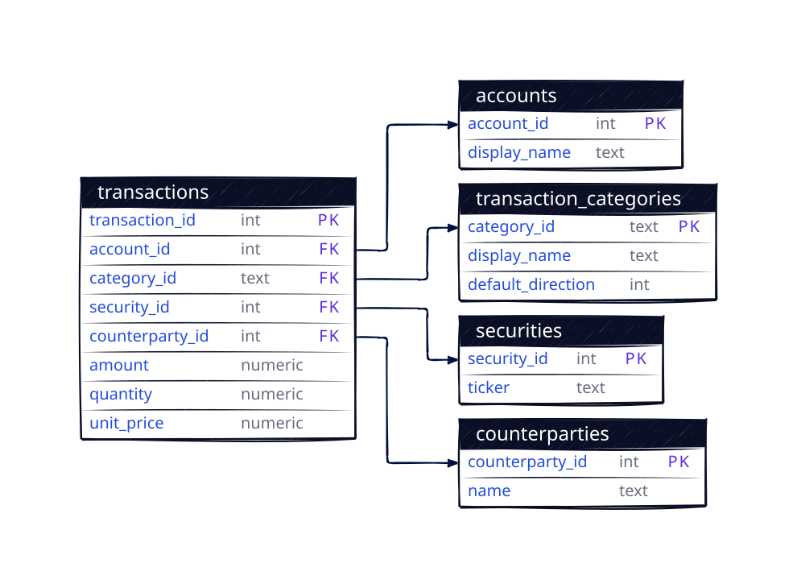

# Doddsville

## Setup

### 1. Install Dependencies

```bash
pixi install
```

### 2. Install the CLI

This step is required after each `pixi install`:

```bash
pixi run install-cli
```

Or use `pixi run dv` directly (auto-installs the CLI).

### 3. Initialize the Database

```bash
pixi run migrate
```

This runs all pending database migrations using [yoyo-migrations](https://ollycope.com/software/yoyo/latest/).

## Usage

All commands use `pixi run dv` (or just `dv` if you activate the shell with `pixi shell`).

**Account Management:**

```bash
pixi run dv account add "Broker Name"   # Create account
pixi run dv account list                # List accounts
```

**Record Transactions:**

```bash
# Stock transactions
pixi run dv add buy "Apple" 10 150.00 -a "Broker"
pixi run dv add sell "Apple" 5 160.00 -a "Broker"
pixi run dv add dividend "Apple" 25.00 -a "Broker"

# Cash transactions
pixi run dv add deposit 1000.00 -a "Broker"
pixi run dv add withdrawal 500.00 -a "Broker"
pixi run dv add interest 10.00 -a "Cash"

# Transfer between accounts
pixi run dv add transfer 500.00 --from "Cash" --to "Broker"
```

**List Transactions:**

```bash
pixi run dv list                    # All transactions
pixi run dv list -a "Broker"        # Filter by account
pixi run dv list -t buy             # Filter by type
```

**Reports:**

```bash
# Summary of all metrics
pixi run dv report summary

# Account balances
pixi run dv report balance

# Cash flow (deposits, withdrawals, dividends, interest)
pixi run dv report cashflow

# Current stock holdings
pixi run dv report holdings

# Investment performance (realized gains/losses)
pixi run dv report performance

# Filter by account or date range
pixi run dv report summary -a "Broker"
pixi run dv report cashflow --from 01.01.2024 --to 31.12.2024
```

## Paperless-ngx Integration

Attach documents to transactions using a paperless-ngx server.

**Setup:**

```bash
# Configure paperless connection
pixi run dv config set paperless_url http://localhost:8000
pixi run dv config set paperless_token your-api-token

# Verify connection
pixi run dv config check
```

**Attach documents to transactions:**

```bash
# Link existing document by paperless ID
pixi run dv add buy "Apple" 10 150.00 -a "Broker" --doc 123

# Upload new document (auto-uploads to paperless)
pixi run dv add buy "Apple" 10 150.00 -a "Broker" --doc ./receipt.pdf

# Multiple documents
pixi run dv add deposit 1000.00 -a "Broker" --doc 123 ./statement.pdf
```

**Add documents to existing transactions:**

```bash
# Link by paperless document ID
pixi run dv doc add 42 123

# Upload and link a file
pixi run dv doc add 42 ./receipt.pdf

# Multiple documents at once
pixi run dv doc add 42 123 456 ./statement.pdf
```

Documents are shown as clickable URLs in `dv list` output.

### Index Parsing

Parse all indices provided in `init.sql` and add their companies to the `company` table:

```bash
pixi run python index.py
```

### Database Migrations

Migrations are managed with [yoyo-migrations](https://ollycope.com/software/yoyo/latest/).

```bash
# Apply pending migrations
pixi run migrate

# Create a new migration
pixi run migrate-new "add_new_table"
```

Migration files are in the `migrations/` directory as plain SQL.

### Running Tests

```bash
pixi run pytest test_cli.py -v
```

## Database Schema



The schema contains the following tables:

- **account** - Financial accounts (brokers, cash accounts)
- **company** - Stock/security information (ISIN, name)
- **transaction** - All transaction records with types: buy, sell, dividend, interest, deposit, withdrawal, transfer
- **transaction_document** - Links transactions to paperless-ngx documents
- **index** - Stock market indices
- **raw_html** - Cached HTML data for scraping

## Tools

- [Pixi](https://pixi.sh) - Package and environment management
- [SQLite CLI](https://sqlite.org/cli.html) - Database interaction
- [D2](https://d2lang.com/) - Diagram language for the schema visualization
